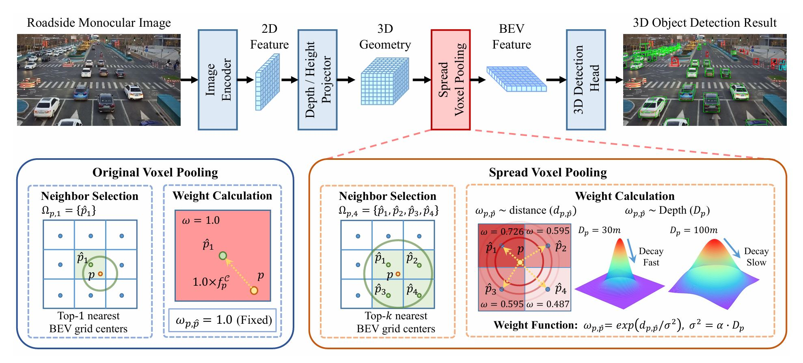

<p align="center">

  <h1 align="center">BEVSpread: Spread Voxel Pooling for Bird’s-Eye-View Representation in Vision-based Roadside 3D Object Detection</h1>
  <p align="center">
    <!-- <a href=""><strong>Wenjie Wang*</strong></a> -->
    <strong>Wenjie Wang*</strong>
    ·
    <!-- <a href=""><strong>Yehao Lu*</strong></a> -->
    <strong>Yehao Lu*</strong>
    ·
    <!-- <a href=""><strong>Guangcong Zheng</strong></a> -->
    <strong>Guangcong Zheng</strong>
    ·
    <!-- <a href=""><strong>Jun Li</strong></a> -->
    <strong>Shuigen Zhan</strong>
    ·
    <!-- <a href=""><strong>Kun Yuan</strong></a> -->
    <strong>Xiaoqing Ye</strong>
    ·
    <!-- <a href=""><strong>Li Wang</strong></a> -->
    <strong>Zichang Tan</strong>
    ·
    <!-- <a href=""><strong>Xinyu Zhang</strong></a> -->
    <strong>Jingdong Wang</strong>
    ·
    <!-- <a href=""><strong>Peng Chen</strong></a> -->
    <strong>Gaoang Wang</strong>
    ·
    <!-- <a href=""><strong>Peng Chen</strong></a> -->
    <strong>Xi Li</strong>    
  </p>
  <h2 align="center">CVPR 2024</h2>

  <div align="center">
    
  </div>
</p>

# Getting Started
## Installation
**a.** Install [pytorch](https://pytorch.org/)(v1.9.0).

**b.** Install mmcv-full==1.6.2  mmdet==2.28.2  mmsegmentation==0.30.0

**c.** Install mmdetection3d
```
git clone https://github.com/open-mmlab/mmdetection3d.git -b 1.0
cd mmdetection3d
pip install  -e .
```

**d.** Install pypcd
```
git clone https://github.com/klintan/pypcd.git
cd pypcd
python setup.py install
```

**d.** Install requirements.
```shell
pip install -r requirements.txt
```
**e.** Install BEVSpread (gpu required).
```shell
python setup.py develop
```

## Prepare Dataset
Download DAIR-V2X-I or Rope3D dataset from official [website](https://thudair.baai.ac.cn/index).

### Symlink the dataset root to `./data/`.
```
ln -s [single-infrastructure-side root] ./data/dair-v2x
ln -s [rope3d root] ./data/rope3d
```

### Convert DAIR-V2X-I or Rope3D to KITTI format.
```
python scripts/data_converter/dair2kitti.py --source-root data/dair-v2x-i --target-root data/dair-v2x-i-kitti
python scripts/data_converter/rope2kitti.py --source-root data/rope3d --target-root data/rope3d-kitti
```

### Visualize the dataset in KITTI format
```
python scripts/data_converter/visual_tools.py --data_root data/rope3d-kitti --demo_dir ./demo
```


The directory will be as follows.
```

data
├── dair-v2x-i
│   ├── velodyne
│   ├── image
│   ├── calib
│   ├── label
|   └── data_info.json
├── dair-v2x-i-kitti
|   ├── training
|   |   ├── calib
|   |   ├── label_2
|   |   └── images_2
|   └── ImageSets
|        ├── train.txt
|        └── val.txt
├── rope3d
|   ├── training
|   ├── validation
|   ├── training-image_2a
|   ├── training-image_2b
|   ├── training-image_2c
|   ├── training-image_2d
|   └── validation-image_2
├── rope3d-kitti
|   ├── training
|   |   ├── calib
|   |   ├── denorm
|   |   ├── label_2
|   |   └── images_2
|   └── map_token2id.json
|       
...
```

### Prepare DAIR-V2X-I or Rope3D infos.
```
python scripts/gen_info_dair.py
python scripts/gen_info_rope3d.py
```
## Train and Eval
Train BEVSpread with 8 GPUs
```
python [EXP_PATH] --amp_backend native -b 2 --gpus 8
```
Eval BEVSpread with 1 GPUs
```
python [EXP_PATH] --ckpt_path [CKPT_PATH] -e -b 2 --gpus 1
```

# Experimental Results
- DAIR-V2X-I Dataset
<table>
     <tr align=center>
        <td rowspan="3">Method</td> 
        <td rowspan="3" align=center>Config File</td> 
        <td rowspan="3" align=center>Range</td> 
        <td colspan="3" align=center>Car</td>
        <td colspan="3" align=center>Pedestrain</td>
        <td colspan="3" align=center>Cyclist</td>
        <td rowspan="3" align=center>model pth</td>
    </tr>
    <tr align=center>
        <td colspan="3" align=center>3D@0.5</td>
        <td colspan="3" align=center>3D@0.25</td>
        <td colspan="3" align=center>3D@0.25</td>
    </tr>
    <tr align=center>
        <td>Easy</td>
        <td>Mod.</td>
        <td>Hard</td>
        <td>Easy</td>
        <td>Mod.</td>
        <td>Hard</td>
        <td>Easy</td>
        <td>Mod.</td>
        <td>Hard</td>
    </tr>
    <tr align=center>
        <td rowspan="4">BEVSpread</td>
        <td><a href=exps/dair-v2x/bev_spread_r101_256x256_100m.py>R101_100m</td>
        <td>[0, 102.4]</td> 
        <td>79.15</td>
        <td>66.86</td>
        <td>66.92</td>
        <td>46.64</td>
        <td>44.61</td>
        <td>44.73</td>
        <td>63.15</td>
        <td>63.55</td>
        <td>63.94</td>
        <td><a href="https://drive.google.com/file/d/1KgU1bQeykqTem1evruoBC0kBk9asmHDY/view?usp=sharing">model</a></td>
    </tr>
<table>
</div>
